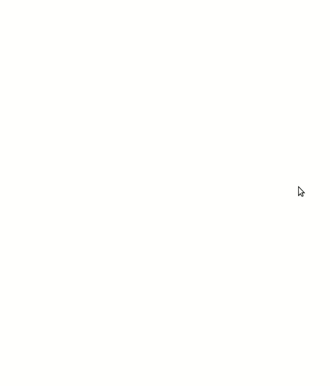
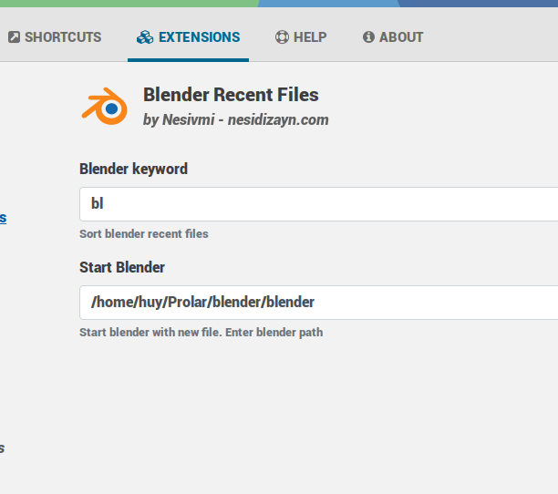

# Ulauncher - Blender Recently

[](https://github.com/nesivmi/ulauncher-blender-recently)

> [Blender Recently](https://github.com/nesivmi/ulauncher-blender-recently) Sort blender recent files

## Preview




## Requirements

* [Ulauncher](https://github.com/Ulauncher/Ulauncher) 5.0+
* [Blender](https://www.blender.org/)


## Install

Open ulauncher preferences window -> extensions -> add extension and paste the following url:

```
https://github.com/nesivmi/ulauncher-blender-recently
```

## Usage
* > bl
* > bl find_text
```
```
## Prefrences

* **Blender** - Main extension keyword. You can change.
* **Start Blender** - Blender App Path



## Links

* [Blender](https://www.blender.org)
* [Ulauncher Extensions](https://ext.ulauncher.io/)
* [Ulauncher 5.0 (Extension API v2.0.0) — Ulauncher 5.0.0 documentation](http://docs.ulauncher.io/en/latest/)
